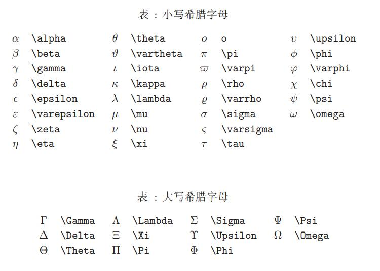

# $Latex$公式入门

**芝士什么**

KATEX是一个让你的文档看起来更专业的排版系统。而markdown支持下的latex显然是书写数学符号的最佳选择。

Chapter 1.1 数学模式
---
在KATEX数学模式中，能够插入两种不同的公式：
- 行间公式：在文本段中显现
- 行内公式：单独作为一行显现

行内公式可以使用`$formula$`来调用，例如`$f(x)=a+b$`可得到$f(x)=a+b$

行间公式通过两对`$$formula$$`来调用，例如：
$$f(x)=a+b$$

而公式中的空格和回车会自动被忽略
例如：调用
>`f(x) = a  +  b`

却得到
>$f(x) = a + b$

但是你可以通过`\quad`来实现插入空格的功能

>$f(x) = \quad a \quad +\quad b$

或者使用双斜杠来实现换行的功能

>`$x+y=2 \\ y+z=3$`

>$x+y=2 \\ y+z=3$

关于方程组的书写将在下面介绍

Chapter1.2 tag编号
---
在latex中你可以使用`\tag{}`指令对公式进行编号，例如：
$$f(x)=ax^2 +bx+c \tag{1.1}$$

值得注意的是，`tag{}`指令只能在行间公式中使用

Chapter 2.1 数学符号
---
$LaTex$中提供了大量的数学符号，所以可以移步
[$Latex$ wiki教科书](https://zh.wikibooks.org/wiki/LaTeX)以获得更加完整的教学。

- 上标 (Powers) 使用`^`符号，前后添加大括号可以明确上标和底的内容，例如：
>`$f(x) = e^{-(x-7)+log x}$`

>$f(x) = e^{-(x-7)+log x}$

- 下标（Indices）使用`_`符号，前后添加大括号可以明确上标和底的内容，例如：

>`$a_{n+1} = 7a_n+\frac{1}{a_n}$`

>$a_{n+1} = 7a_n+\frac{1}{a_n}$

- 分数 使用`\frac{numerator}{denominator}`命令来插入，并且可以嵌套，例如

>`$\frac{1}{ \frac{1}{a} + \frac{1}{b}}$`

>$\LARGE{\frac{1}{ \frac{1}{a} + \frac{1}{b}}} $

- 根号 使用`\sqrt{}`命令插入，同样可以嵌套，例如

>`$f(x) = \sqrt{x^2} = |x|$`

>$f(x) = \sqrt{x^2} = |x|$

- 求和与积分 分别使用`\sum`与`\int`来插入，使用`^`表示上限，使用`_`表示下线，例如

>`$$\sum_{i=1}^{n} i^2$$`

>$$\sum_{i=1}^{n} i^2+2i+1$$

>`$$\int_{a}^{b} {\sqrt{x^2-1}}$$`

>$$\int_{a}^{b} {\sqrt{x^2-1}}$$

- 上下标记 \overline, \underline 分别在表达式上、下方画出水平线,\overbrace, \underbrace 分别在表达式上、下方给出一个水平的大括号,`-`与`^`指定括号上下标，例如：
>`$$\overline{x+y} \qquad \underline{a+b}$$`

>$\overline{x+y} \qquad \underline{a+b}$

>`$$\overbrace{1+2+\cdots+n}^{n个} \qquad \underbrace{a+b+\cdots+z}_{26}$$`

>$$\overbrace{1+2+\cdots+n}^{n个} \qquad \underbrace{a+b+\cdots+z}_{26}$$

- 向量  使用`\vec`来表示向量，`\overrightarrow`来表示箭头指向右的向量，`\overleftarrow`来表示箭头向左的向量，例如：
>`$$\vec{a} + \overrightarrow{AB} + \overleftarrow{DE}$$`

>$\vec{a} + \overrightarrow{AB} + \overleftarrow{DE}$

- 省略号三元点 使用\dots调用，且\ldots点位于基线上，\cdots点设置为居中，\vdots使其垂直，\ddots对角线排列，例如：

>`$$ x_{1},x_{2},\ldots,x_{5}  \quad x_{1} + x_{2} + \cdots + x_{n} $$`

>$ x_{1},x_{2},\ldots,x_{5}  \quad x_{1} + x_{2} + \cdots + x_{n} $

下面是他们的对比

>$\ldots \quad \cdots \quad \vdots \quad \ddots$

Chapter 2.2 矩阵、多行公式
---
## Chapter 2.2.1 矩阵

KATEX中使用矩阵环境来实现矩阵排列，常用的矩阵环境有`\matrix` `\bmatrix` `\vmathrix` `\pmatrix` 其区别在于外面的括号不尽相同

|  |  |        
| :----| :---- | 
| matrix | $$\begin{matrix} a & b \\ c & d \end{matrix}$$ | 
| bmatrix | $$\begin{bmatrix} a & b \\ c & d \end{bmatrix}$$ | 
| vmatrix | $$\begin{vmatrix} a & b \\ c & d \end{vmatrix}$$ | 
| pmatrix | $$\begin{pmatrix} a & b \\ c & d \end{pmatrix}$$ | 

其中`&`用于分隔列，`\`用于分隔行 ,在begin和end中填入对应的格式说明

下面是一个大型矩阵的例子：
```
\begin{bmatrix}
		c_{0}&c_{n-1}&c_{n-2}&\cdots &c_{1}\\
		c_{1}&c_{0}&c_{n-1} &  \cdots &c_{2}\\
		c_{2}&c_{1}&c_{0}&\cdots  &c_3 \\
		\vdots &\vdots& \vdots&\ddots &\vdots \\
		c_{n-1}&c_{n-2}&c_{n-3}&\dots &c_{0}
\end{bmatrix}

```

$$\begin{bmatrix}
		c_{0}&c_{n-1}&c_{n-2}&\cdots &c_{1}\\
		c_{1}&c_{0}&c_{n-1} &  \cdots &c_{2}\\
		c_{2}&c_{1}&c_{0}&\cdots  &c_3 \\
		\vdots &\vdots& \vdots&\ddots &\vdots \\
		c_{n-1}&c_{n-2}&c_{n-3}&\dots &c_{0}
\end{bmatrix}$$

## Chapter 2.2.2 多行公式
与矩阵类似 KATEX中需要使用cases环境来书写多行公式（如分段函数，多元方程组等），例如：
```
$$
\begin{cases}
x^2+x+1 &x<2\\
3 &x=2 \\ 
|x|+7^x &x>2
\end{cases}
$$
```
$$
f(x) = 
\begin{cases}
x^2+x+1 &x<2\\
3 &x=2 \\ 
|x|+7^x &x>2
\end{cases}
$$

Chapter 3.1特殊符号
---

作为一个成熟的数学写作工具，katex当然包含了所有的数学符号与字母，你可以使用英文或读音召唤他们：

|||||
|:---|:---|:---|:---|
|alpha|$\alpha$|Alpha|$\Alpha$|
|beta|$\beta$|Beta|$\Beta$|
|gamma|$\gamma$|Gamma|$\Gamma$|
|delta|$\delta$|Delta|$\Delta$|
|epsilon|$\epsilon$|Epsilon|$\Epsilon$|

|||||
|:---|:---|:---|:---|
|le|$\le$|nleq|$\nleq$|
|ge|$\ge$|ngeq|$\ngeq$|
|sim|$\sim$|nsim|$\nsim$|
|simq|$\simeq$|nsimq|$\not \simeq$|

下面附上一张表格

