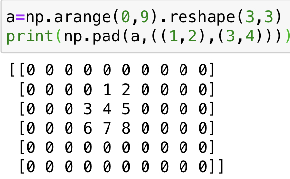

# Numpy

# Chapter 1 数组的创建

## Chapter 1.1 通过基本方法创建

**对于`np.array()`括号中可以赋予初始的值，np会自动转换为array类对象**
  
  -  将list转换为array `np.array([1,2,3,4,5])`
  
  - 将元组转换为array `np.array((1,2,3,4,5))`
  
  - 将range对象转换为array `np.array(range(5))`
  
  - 赋予二维数组初值 `np.array([[1,2,3],[4,5,6]])`

## Chapter 1.2 通过内置函数创建特殊的array

- 创建值为1的数组 `np.ones(shape,dtype=none)`

- 创建值为0的数组 `np.zeros(shape,dtype=none)`

- 创建值为指定值的数组 `np.full(shape,fill_value,dtype=none)`
需要注意的是，当没有指定dtype时，默认使用float32类型

## Chapter 1.3 通过特殊函数创建

>`np.arange(start,stop,step)`

- 其中 start代表起始值，stop代表终止值（仅包含起始值，不包含终止值），step代表间隔，即步长

- 这与python原生内置函数range相似
>`np.identity(shape)`

- 创建一个 `n*n`的单位矩阵

# Chapter 2 数组的修改

## Chapter 2.1 `np.append()`添加

append函数返还一个array类型的对象，所以append操作并不影响原数组

>`np.append(arr,values,axis=None)`

其中arr表示被操作的数组，values可以是一个值，也可以是一个数组

当axis被指定时，values和arr在指定的轴上需要是相同的shape,并在该轴方向上相加，这与`np.stack`函数相像

当`axis=None`时，会将原数组展平为一位数组，
例如：
> `np.append([[1,2,3]],[[4,5,6]],axis=0)`

## Chapter 2.2 `np.insert()`插入

- insert函数返回一个array类型的对象

- 同样的,insert函数不影响原数组,插入元素都在所给位置之前

>`np.insert(arr,object,values,axis)`

- 其中object表示插入位置
- 其余同append

## Chapter 2.3 `np.pad()`池化

>`np.pad(arr,pad_width,mode, **kwargs)`

其中 `pad_width`表示每个轴要填充的数据的数目,例如：

>`a=np.array([[1,2,3],[4,5,6]])`

>`np.pad(a,((2,3),(4,5)))`

(2,3)表示第0轴上填充2行，下填充3行\
(4,5)表示第1轴上填充4行，下填充5行



## Chapter 2.4 `np.tile()`重复

>`np.tile(arr,reps)`

其中reps一般为一个元组，其中元组每个元素代表每一维度扩充的次数
tile是以arr整体为单位扩充

## Chapter 2.5 `np.repeat()`重复

>`np.repeat(arr,repeats,axis=None)`

arr表示被操作的array对象，repeats表示重复的次数，axis表示重复的维度

repeat是以array中每个元素为单位进行扩充重复。

# Chapter 3 The Game of Convey
## Project Introduction 游戏简介
> 在20世纪60年代末，Conway设计出了一种神奇的数学游戏，后来被人们称为“生命游戏”。该生命游戏有一些基于简单数学规则的元胞组成，它能模拟出元胞的生、死以及繁殖的过程。“生命游戏”的基本思想是给定一个初始构型，然后观察该构型按照Conway的基因定律（genetic laws）进行的演化。1970年Conway的朋友Garnder在《科学美国人》上发表了第一篇关于生命游戏的文章，此后生命游戏广为流传。Gardner曾经写道：“生命游戏不仅仅使Conway成为一个家喻户晓的人物，而且开创了一个全新的数学研究领域——元胞自动机”。        

## Game Rules 游戏规则

- 游戏形式

  1. 元胞分布在规则划分的二维方形网格上；

  2. 元胞具有0、1两种状态，0代表“死”，1代表“生”

  3. 元胞采用Moore邻居形式
- 演化规则

  对于活的元胞：

  1. 生存：如果该元胞的邻居中有2个或者3个元胞是活的，那么它将继续生存下去；

  2. 死亡：如果它的邻居有4个及以上元胞是活的，那么它将死去；如果它的邻居只有一个或者没有活的元胞，那么它将死去。

  对于死的元胞：

  3. 繁殖：如果它的邻居有3个元胞是活的，那么它将变成活的元胞。

## Ideas

不难看出，对于游戏来说最关键的数据在于求解一个元胞附近有多少个存活的细胞。对于向量化的array来说，我们不妨使用错位相加的方法。

即对于$(i,j)$处的元胞来说，想要统计右下角$(i+1,j+1)$是否有元胞的最好方法是将矩阵向右上角平移$1$个单位长度，此时新矩阵$(i,j)$处的情况即为我们想要知道的情况。

则，对于原矩阵向八个方向位移后的新矩阵之和便为周围存活细胞之和

对于平移的功能实现，我们不妨使用pad函数圈0的形式，使8个矩阵大小统一，控制pad 0 的位置来实现平移操作

于是我们有：
- 对于初始元胞的分布，我们不妨使用随机数生成一个01矩阵
- 对于某一状态下的地图，使用pad统计周围存活数量
- 对于已死亡的细胞，我们使用`np.where`函数，当统计周围存活矩阵$a_{i,j} > 3$时，$map_{i,j}$ 赋值为1
- 对于已存活的细胞，我们同样使用`np.where`函数，当$a_{i,j} \neq 2 \ or\ 3$时，我们在原地图上减去该位置的1


## Code Time

```python
import torch
from torch.distributions import multinomial
from d2l import torch as d2l
import numpy as np
import matplotlib.pyplot as plt

#数据规模调整
n,m,T = (50,50,100)
#n与m代表n*m的初始地图大小

#统计附近细胞数
def PADDING(mapp):
    #初始化为0便于累加，由于padding是四面的，所以每维增加2
		rep=np.zeros((n+2,m+2))
		#从八个方向进行padding
    rep+=np.pad(mapp,((1,1),(0,2)))
    rep+=np.pad(mapp,((1,1),(2,0)))
    rep+=np.pad(mapp,((0,2),(0,2)))
    rep+=np.pad(mapp,((0,2),(2,0)))
    rep+=np.pad(mapp,((2,0),(0,2)))
    rep+=np.pad(mapp,((2,0),(2,0)))
    rep+=np.pad(mapp,((0,2),(1,1)))
    rep+=np.pad(mapp,((2,0),(1,1)))
		#切片，仅返还中心n*m的有效区域
    return rep[1:-1,1:-1]

#初始化，随机地图
MAP = np.random.randint(low=1,high=100,size=(n,m))
ONE = np.ones((n,m))
ZERO = np.zeros((n,m))
MAP = np.where(MAP>50,ONE,ZERO)#1或0对半概率
print("the origin map\n",MAP,'\n',"="*20)#输出原始地图

#开始T次convey模拟
while(T):
    ANTYMAP = np.where(MAP,ZERO,ONE)#取反的地图
    AROUND=PADDING(MAP)#获得附近细胞值
		#按照规定进行更新地图
		#np.where(AROUND>=3,ONE,ZERO)*ANTYMAP 代表原本为0
    MAP=MAP+np.where(AROUND>=3,ONE,ZERO)*ANTYMAP-np.where(AROUND <2,ONE,ZERO)*MAP-np.where(AROUND>3,ONE,ZERO)*MAP
    T-=1
    #print(np.where(MAP,filled_gird,unfilled_gird))
    #展示plt
    Pho=np.where(MAP,[0,0,0],[255,255,255])
    
    one_indexes = np.transpose(np.nonzero(MAP == 1))
    plt.ion()
    plt.scatter(one_indexes[:,0]+1,one_indexes[:,1]+1,c='black',marker='o')
    plt.xticks(np.arange(1,n+1))
    plt.yticks(np.arange(1,m+1))
    plt.xlabel('X')
    plt.ylabel('Y')
    plt.grid(True,which='both')
    plt.show()
    time.sleep(0.2)
    #plt.close()
```

# Chapter 4 数组的内置数据类型对象

## Chapter 4.1 dtype的定义

>`class numpy.dtype(obj, align=False ,copy=False)`

这里类似于C中结构体的定义，将object对象转换为dtype类型的对象。即，将作者自定义的对象封装入dtype中。

align-是否按照C编译器中的结构体输出格式对齐的变量

copy-是拷贝变量，还是只是对象的引用

## Chapter 4.2 使用元组生成新的dtype

//施工中👷